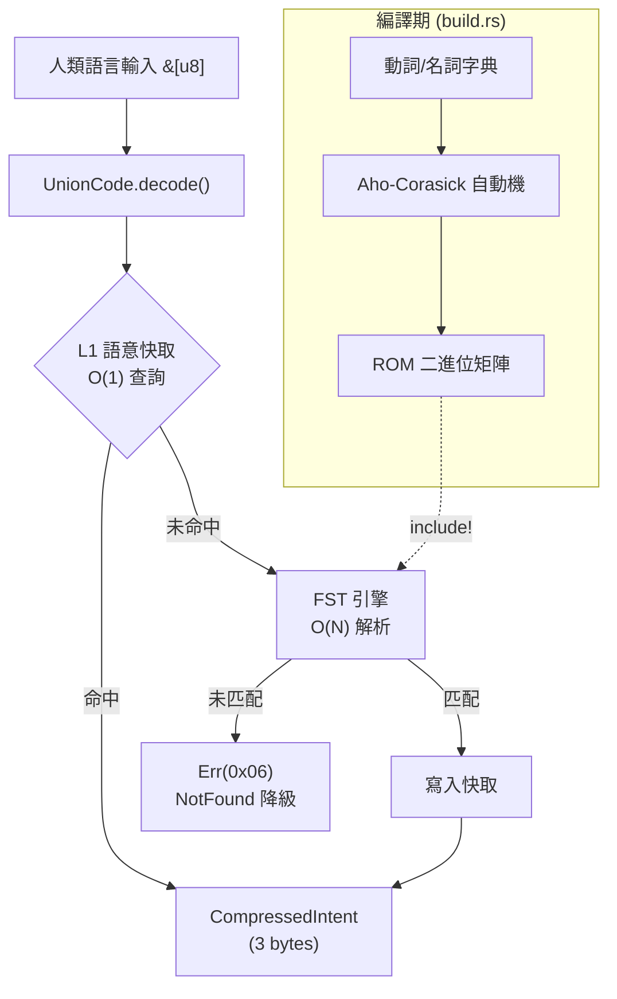

# UnionCode 審計報告

> **日期**: 2026-06-05  
> **範圍**: 完整程式碼審計 — 架構、正確性、安全性、效能、風格  
> **建置狀態**: ✅ 編譯通過 · ✅ 8/8 測試通過 · ⚠️ 2 個 Clippy 警告

---

## 1. 專案概覽

| 項目 | 值 |
|---|---|
| Crate 名稱 | `UnionCode` |
| Edition | 2024 |
| `#![no_std]` | ✅ 是 (測試時 fallback `std`) |
| 原始碼檔案 | [lib.rs](file:///Users/kuangtalin/Documents/UnionCode/src/lib.rs) (558 行) |
| 建置腳本 | [build.rs](file:///Users/kuangtalin/Documents/UnionCode/build.rs) (188 行) |
| 依賴 | `dualcache-ff 0.4.0`, `heapless 0.8` |

### 架構圖



---

## 2. 發現項目總覽

| 嚴重性 | 數量 | 類別 |
|--------|------|------|
| 🔴 嚴重 (Critical) | 1 | 記憶體安全 / Soundness |
| 🟠 高 (High) | 2 | 正確性 / 健壯性 |
| 🟡 中 (Medium) | 4 | 效能 / 設計 / 可維護性 |
| 🔵 低 (Low) | 3 | 風格 / 最佳實踐 |

---

## 3. 詳細審計發現

### 🔴 C-01：`CompressedIntent` 使用 `#[repr(C, packed)]` 存在未對齊存取風險

**檔案**: [lib.rs:14-19](file:///Users/kuangtalin/Documents/UnionCode/src/lib.rs#L14-L19)

```rust
#[repr(C, packed)]
pub struct CompressedIntent {
    pub opcode: u8,
    pub payload_id: u16, // ← 未對齊的 u16
}
```

**問題**: `packed` 結構的欄位可能未對齊。直接透過引用 (`&self.payload_id`) 存取 `payload_id` 在某些平台上是 **未定義行為 (UB)**。雖然目前 `#[derive(Copy)]` 使得多數存取透過 copy 完成，但任何未來的引用存取（例如 `&intent.payload_id`）都會觸發 UB。

此外，`heapless::FnvIndexMap` 內部儲存 `CompressedIntent` 值時可能以引用方式操作，這取決於 `heapless` 的內部實作。

**建議**: 
- 若真的需要 3 bytes 表示，改為手動序列化/反序列化，移除 `packed`。
- 或者接受 4 bytes 的大小，使用 `#[repr(C)]` 即可安全對齊。

---

### 🟠 H-01：FST ROM 矩陣缺乏邊界檢查 — 惡意或損壞的矩陣可導致 panic

**檔案**: [lib.rs:191-243](file:///Users/kuangtalin/Documents/UnionCode/src/lib.rs#L191-L243)

```rust
fn read_fail_state(&self, offset: usize) -> usize {
    let flags = self.rom_matrix[offset]; // ← 可能越界
    // ...
    u16::from_le_bytes([self.rom_matrix[pos], self.rom_matrix[pos + 1]]) as usize
}
```

`FstEngine` 的所有內部方法（`read_fail_state`、`read_outputs`、`find_transition`）都直接以 `[]` 索引存取 `rom_matrix`，沒有任何邊界驗證。若 ROM 資料損壞或被竄改，程式將直接 **panic**。

在 `no_std` 嵌入式環境中，panic 通常意味著裝置重啟。

**建議**:
- 在 `FstEngine::new()` 中新增一個 `validate_rom()` 方法，在初始化時一次性驗證矩陣的完整性（各節點偏移量、轉移指標皆在合法範圍內）。
- 考慮在 ROM 開頭加入魔術數字 (magic) 與 CRC 校驗。

---

### 🟠 H-02：`EdgeSemanticCache` 的 `get_intent` 透過 `RefCell` 執行可變操作 — 可能 panic

**檔案**: [lib.rs:62-74](file:///Users/kuangtalin/Documents/UnionCode/src/lib.rs#L62-L74)

```rust
fn get_intent(&self, hash: u32) -> Option<CompressedIntent> {
    if self.map.contains_key(&hash) {
        let mut order = self.order.borrow_mut(); // ← RefCell borrow
        // ...
```

`get_intent` 的簽名是 `&self`（不可變引用），但內部透過 `RefCell::borrow_mut()` 修改 LRU 順序。這在單執行緒 `no_std` 環境中是安全的，但有兩個隱患：

1. 若未來有任何場景在持有 `order` borrow 的同時再次呼叫 `get_intent`（例如遞迴或 callback），會在執行期 **panic**。
2. `RefCell` 的執行期借用檢查在嵌入式環境中增加了不可預期的 panic 點。

**建議**: 考慮將 LRU 追蹤從 `get_intent` 中移除（改為 FIFO 驅逐策略），或將 `get_intent` 的簽名改為 `&mut self`，同時調整 `SemanticCache` trait。

---

### 🟡 M-01：`fast_hash` 缺乏雪崩效應驗證 — 潛在碰撞風險

**檔案**: [lib.rs:303-311](file:///Users/kuangtalin/Documents/UnionCode/src/lib.rs#L303-L311)

```rust
fn fast_hash(&self, data: &[u8]) -> u32 {
    let mut hash = 0u32;
    const K: u32 = 0x27220a95;
    for &b in data {
        hash = (hash.rotate_left(5) ^ (b as u32)).wrapping_mul(K);
    }
    hash
}
```

這是一個自訂的 hash 函式。雖然在效能上可能很快，但：
- 初始值為 0，對空輸入會返回 0（雖然空輸入不太可能出現）。
- 未經 SMHasher 等工具驗證其碰撞率與分佈品質。
- UTF-8 中文字元每個字佔 3 bytes，rotate 5 bits 的選擇是否最佳需驗證。

**建議**: 使用已驗證的 FxHash 演算法（或至少對現有函式跑 SMHasher 測試），並為測試補充碰撞率檢測。

---

### 🟡 M-02：`SemanticCache` trait 的 `put_intent` 回傳 `Result<(), ()>` — 語意不清

**檔案**: [lib.rs:36](file:///Users/kuangtalin/Documents/UnionCode/src/lib.rs#L36)

```rust
fn put_intent(&mut self, hash: u32, intent: CompressedIntent) -> Result<(), ()>;
```

Clippy 已標記此問題 (`clippy::result_unit_err`)。`()` 作為錯誤類型不提供任何診斷資訊。

**建議**: 定義一個 `CacheError` enum：
```rust
#[derive(Debug)]
pub enum CacheError {
    Full,
    InternalError,
}
```

---

### 🟡 M-03：`build.rs` 中 Aho-Corasick 自動機的 failure 函式輸出傳播語意可能不正確

**檔案**: [build.rs:71-77](file:///Users/kuangtalin/Documents/UnionCode/build.rs#L71-L77)

```rust
// Propagate outputs from fail_state if they are missing in curr
if nodes[curr].opcode.is_none() {
    nodes[curr].opcode = nodes[fail_state].opcode;
}
if nodes[curr].payload_id.is_none() {
    nodes[curr].payload_id = nodes[fail_state].payload_id;
}
```

這將 failure 鏈上的 opcode/payload_id **輸出傳播**到當前節點。然而在 Aho-Corasick 的標準語意中，輸出傳播用於收集**所有**匹配的模式，而非覆蓋。目前的實作將 failure 鏈的輸出與 trie 自身的輸出混合寫入同一個欄位，可能導致在特定輸入模式下產生**意外的 opcode/payload_id 組合**。

例如：如果某個 failure 路徑的中間節點碰巧帶有 opcode 但沒有 payload_id，這個「半匹配」的 opcode 會被傳播到不相關的節點。

**建議**: 仔細設計哪些輸出應該被傳播，並增加整合測試覆蓋 failure 傳播的邊界情況。

---

### 🟡 M-04：`TokenWindow` 結構已定義但未使用

**檔案**: [lib.rs:22-25](file:///Users/kuangtalin/Documents/UnionCode/src/lib.rs#L22-L25)

```rust
pub struct TokenWindow<'a> {
    pub raw: &'a [u8],
    pub cursor: usize,
}
```

這個結構在規格書中被描述為「雜訊過濾後的 Token 視窗」，但目前完全未被使用。它的存在增加了維護負擔，且 `#![allow(dead_code)]` 隱藏了此警告。

**建議**: 若近期不會使用，移除它。若有計劃使用，補充文件說明其用途與時程。

---

### 🔵 L-01：Crate 名稱不符合 Rust 慣例

```
warning: crate `UnionCode` should have a snake case name
```

`Cargo.toml` 中 `name = "UnionCode"` 使用 PascalCase，Rust 慣例是 snake_case (`union_code`)。

**建議**: 改為 `name = "union_code"`。

---

### 🔵 L-02：`#![allow(dead_code, unused_variables)]` 全域壓制警告

**檔案**: [lib.rs:2](file:///Users/kuangtalin/Documents/UnionCode/src/lib.rs#L2)

全域壓制 `dead_code` 和 `unused_variables` 會隱藏真正的死碼問題（如上述 `TokenWindow`）。

**建議**: 移除全域 `allow`，只在確實需要的個別項目上標記 `#[allow(dead_code)]`。

---

### 🔵 L-03：`extern crate alloc` 已宣告但未使用

**檔案**: [lib.rs:4](file:///Users/kuangtalin/Documents/UnionCode/src/lib.rs#L4)

```rust
extern crate alloc;
```

目前程式碼中沒有任何 `alloc::` 的使用。這個宣告是多餘的。

**建議**: 移除，直到真正需要 `alloc` 時再加入。

---

## 4. 安全性摘要

| 面向 | 狀態 | 備註 |
|------|------|------|
| 記憶體安全 | ⚠️ 潛在風險 | `packed` struct 的未對齊存取 (C-01) |
| Panic 安全 | ⚠️ 潛在風險 | ROM 越界 (H-01)、RefCell panic (H-02) |
| `unsafe` 使用 | ✅ 無 | 未使用 `unsafe` 程式碼 |
| 依賴安全 | ✅ 良好 | `dualcache-ff` 與 `heapless` 是成熟 crate |
| 資料競爭 | ✅ 安全 | `no_std` 單執行緒環境 |

---

## 5. 效能觀察

| 路徑 | 複雜度 | 評估 |
|------|--------|------|
| L1 快取命中 | O(1) hash + O(N) LRU 搜尋 | ⚠️ LRU `position()` 掃描使 `get_intent` 實際為 **O(N)**，非 O(1) |
| FST 解析 | O(N × T) | N = 輸入長度, T = 每節點最大轉移數 (線性掃描) |
| LRU 驅逐 | O(N) | `Vec::remove(0)` 導致整個向量 shift |

> [!IMPORTANT]
> `get_intent` 中的 LRU 追蹤使用 `position()` 線性搜尋 + `remove(pos)` 線性移動，在 N=256 時效能可能不如預期的 O(1)。對於 SRAM 受限的 ESP32 環境，考慮改為 Clock (CLOCK) 算法或簡單的 FIFO 策略。

---

## 6. 測試覆蓋分析

| 測試 | 覆蓋範圍 | 狀態 |
|------|----------|------|
| `test_edge_semantic_cache_lru` | LRU 驅逐邏輯 | ✅ |
| `test_edge_semantic_cache_update_existing` | 更新現有條目 | ✅ |
| `test_fast_hash` | Hash 一致性 | ✅ 但缺碰撞率測試 |
| `test_fst_engine_matching` | 基本中英文匹配 | ✅ |
| `test_fst_engine_edge_cases` | 空輸入、反序、多重匹配 | ✅ |
| `test_union_code_pipeline` | 完整管線 + fallback | ✅ |
| `test_static_dual_cache_integration` | StaticDualCache 整合 | ✅ |
| `test_dual_cache_ff_integration` | DualCacheFF 整合 | ✅ |

**缺失的測試覆蓋**:
- ROM 矩陣損壞/畸形資料的防禦測試
- `fast_hash` 碰撞分佈測試
- 快取容量為 1 的極端邊界測試
- 超長輸入（數千 bytes）的壓力測試

---

## 7. 優先行動計劃

```mermaid
gantt
    title 建議修復優先序
    dateFormat X
    axisFormat %s

    section 🔴 嚴重
    C-01 移除 packed 或改安全存取  :crit, 0, 1

    section 🟠 高
    H-01 ROM 驗證機制              :2, 3
    H-02 RefCell / LRU 重構        :3, 4

    section 🟡 中
    M-01 Hash 品質驗證             :5, 6
    M-02 CacheError enum           :6, 7
    M-03 Failure 傳播語意          :7, 8
    M-04 移除 TokenWindow          :8, 9

    section 🔵 低
    L-01~L-03 風格修正             :9, 10
```



| 優先序 | 項目 | 預估工作量 |
|--------|------|-----------|
| 1 | C-01: 解決 `packed` struct 安全性 | 30 分鐘 |
| 2 | H-01: 新增 ROM 矩陣驗證 | 2 小時 |
| 3 | H-02: 重構 LRU 避免 RefCell | 1~2 小時 |
| 4 | M-01~M-04: 中等優先修復 | 各 30 分鐘~1 小時 |
| 5 | L-01~L-03: 風格清理 | 15 分鐘 |

---

## 8. 總結

UnionCode 作為一個 `no_std` 語意壓縮引擎，架構設計清晰，核心管線（Hash → Cache → FST → Fallback）邏輯正確，8 個測試全數通過。`build.rs` 的 Aho-Corasick 自動機在編譯期生成靜態 ROM 矩陣的做法非常優雅，符合零分配的設計目標。

主要風險集中在 **`packed` struct 的潛在 UB**、**ROM 解析缺乏防禦性邊界檢查**、以及 **LRU 的 RefCell runtime panic 風險**。這些在嵌入式環境中尤為關鍵，建議優先處理。
